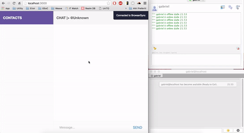

# What is it

This is a project I've developed with the goal to become more familiar with how XMPP works.
My goal was to create a simple chat able to exchange basic stanzas with my ejabberd server.

To do so, I've splitted the project into 3 parts:
  - **Client Side**:
    - Website
  - **Server Side**:
    - Ejabberd & Phoenix
    - XMPP Parser and Mapper (Extracted as libraries available on github)

Throughout the development, I've noticed that was possible to extract some `libraries`, and I did so, you can find them at:

**XMPP Client**: [https://github.com/gabrielgatu/elixible](https://github.com/gabrielgatu/elixible)

**XMPP Parser** [https://github.com/gabrielgatu/xmpp_mapper](https://github.com/gabrielgatu/xmpp_mapper)

## Example

## Warning

This project has been developed in roughly 1 month and not maintained. It is very unstable and usefoul only for learning purpose. Said this, you are the welcome to do wathever you want with it :)

## Infos

For more information, go to the page of the 2 libraries. And **have an awesome day** ;)
